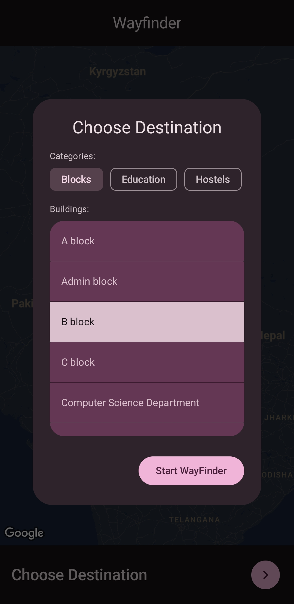
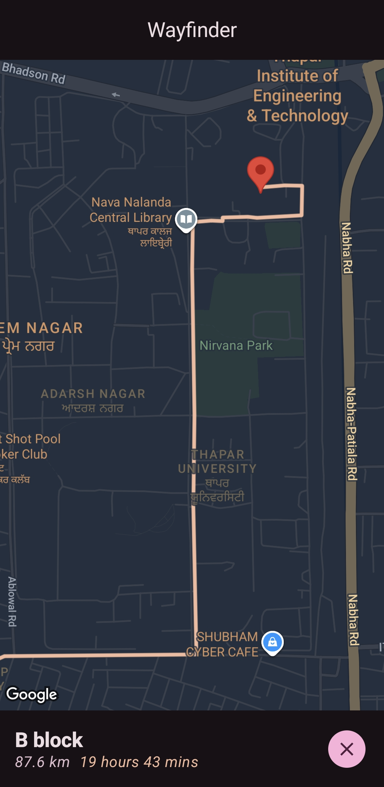

# 🎓 AR Campus Navigator – Capstone Project

An Android app that enables seamless **AR-based navigation on campus**, using **ARCore** and real-world coordinates relying on Google Maps. Designed specifically for students and visitors to intuitively find buildings, departments, labs, or facilities within the university campus using **Augmented Reality** overlays.

---

## 📱 App Features

- 🔍 **AR Navigation**: Uses Google's **ARCore** to overlay directional guidance directly onto the physical environment.
- 🧭 **Custom Campus Mapping**: Built-in map data specific to your institution.
- 🎓 **Campus POIs (Points of Interest)**: Navigate to departments, hostels, libraries, cafeterias, etc.
- ✅ **Minimal UI**: Clean and simple design tailored for students and first-time visitors.
- 🚀 **Currently on Play Store under Closed testing**

---

## 🛠️ Tech Stack

| Technology | Purpose |
|-----------|---------|
| **Android (Java/Kotlin)** | Native mobile development |
| **ARCore** | Augmented Reality functionality |
| **Sceneform** | 3D rendering of navigation objects |
| **Room DB / SQLite** | Local data storage for POIs |
| **GPS & Sensors** | Device orientation + location |
| **Play Console** | App distribution via Play Store |

---

## 🧪 How It Works

1. User launches app and selects a destination (e.g., "Library").
2. Device location is matched against pre-tagged campus coordinates.
3. AR arrow/direction markers are overlaid in real space using ARCore along with satellite view of campus (like Google Maps).
4. User follows arrows in real-time, reaching the selected location.

---

## 🏛️ Target Audience

- University Students
- Faculty and Staff
- Visitors attending seminars, events, or campus tours

---

## 🧾 Play Store Publishing
- App is signed, versioned, and uploaded via **Android App Bundle (.aab)**
- All required assets, descriptions, and screenshots provided on Play Console
- Compliant with Play Store **ARCore Device Support** requirements

---

## 📸 Screenshots

| Destination Choose Alert                          | Destination Navigation                           |
|---------------------------------------------------|--------------------------------------------------|
|   |  |

---

## 📌 Installation (For Local Testing)

1. Clone the repository  
   ```bash
   git clone https://github.com/varunkumar2004/WayFinder.git
